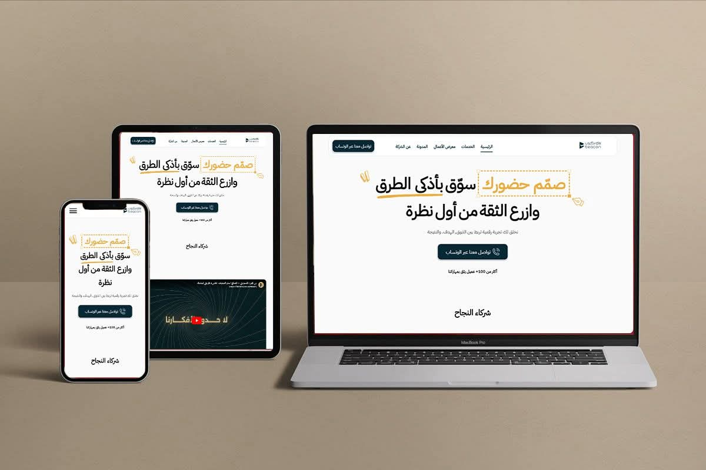

<h1 align="center">Becon Marketing</h1>

Marketing agency website delivered as a full-stack web project for business presentation and content flexibility.

  
  
  

  

## Overview

Becon Marketing is a company website developed to present agency services in a clean and professional way while allowing part of the content to remain dynamic and manageable. The project focused on balancing presentation, maintainability, and production readiness.

## Project Snapshot

- Role: Full-Stack Developer
- Worked through: Becon Agency
- Focus: Frontend, backend, dynamic sections, content workflow, and production delivery
- Live website: https://www.beccon4mk.com/

## Tech Stack

  

## Key Features

- Agency website implementation
- Dynamic content sections
- Partial content management workflow
- Full-stack production delivery

## Project Status

- Full source code will be added later
- This repository is currently published as a documented project reference

## Note

This repository is designed to present the project publicly and can be updated later with the complete source code.
